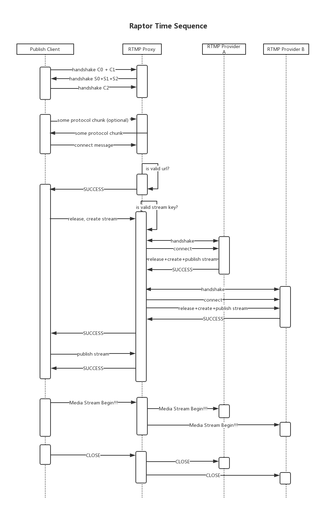

# Raptor
Raptor is a dynamic RTMP proxy written by Kotlin.

## Example
> Please see raptor-server/src/test/kotlin/me/zarafa/raptor/server/Example.kt
```kotlin
package me.zarafa.raptor.server

import me.zarafa.raptor.api.Address
import me.zarafa.raptor.api.ChannelManager

object Example {

  private val channels: ChannelManager = ExampleChannelManager({ _ -> "?k=12345678" })
  private val server: RTMPProxyServer

  init {
    // Start live => rtmp://127.0.0.1:1935/test?k=12345678
    // If you use OBS, please fill URL => rtmp://127.0.0.1:1935/test, StreamKey => ?k=12345678
    // If everything is ok, your live will broadcast to upstream1 and upstream2
    // ***** NOTICE: PLEASE REPLACE UPSTREAMS WITH YOUR OWN URLS!!! *****
    val upstream1 = "rtmp://pili-publish.maxwon.cn/maxwon-live/foo?e=1491469885&token=Thphesb5UQHYEMKQspI4LrUUKO3gWd47rEvGdHcK:j3cKLk84CYPx3koCQru6jlLoRO4="
    val upstream2 = "rtmp://pili-publish.maxwon.cn/maxwon-live/bar?e=1491469885&token=Thphesb5UQHYEMKQspI4LrUUKO3gWd47rEvGdHcK:j3cKLk84CYPx3koCQru6jlLoRO4="
    this.channels.save("test", arrayOf(Address.from(upstream1)!!, Address.from(upstream2)!!))
    this.server = RTMPProxyServer(this.channels)
  }

  @JvmStatic
  fun main(args: Array<String>) {
    this.server.run()
  }
}
```

## Time Sequence

